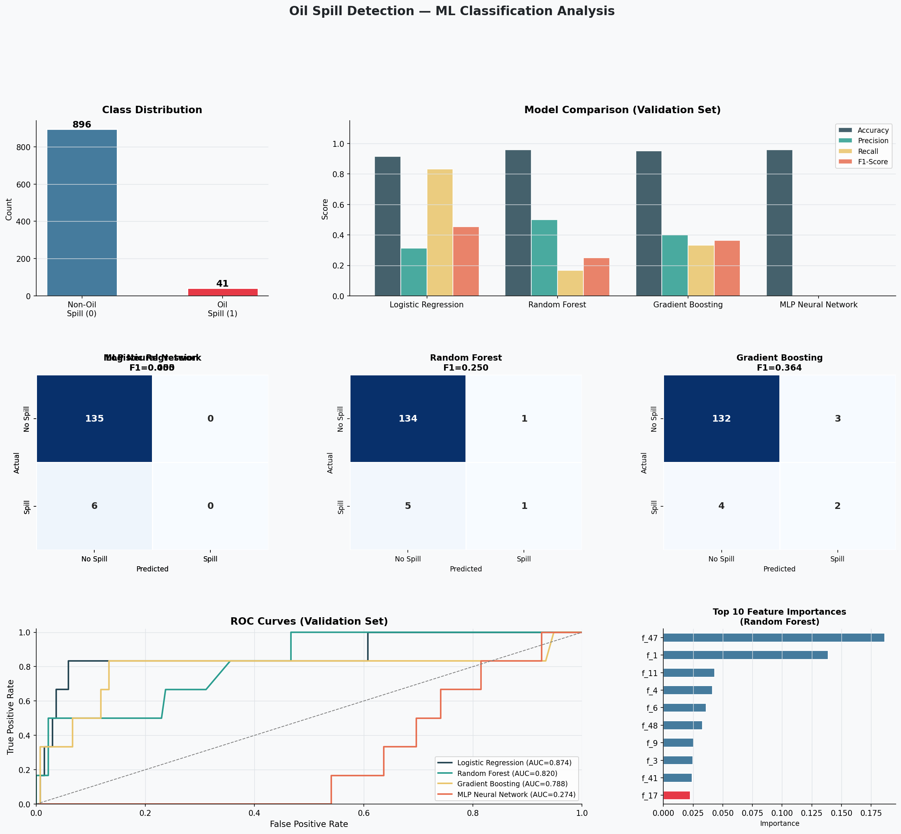

# 🛢️ Oil Spill Detection using Machine Learning

> A machine learning project for binary classification of oil spills from satellite imagery feature data — built to support environmental monitoring and ocean ecosystem protection.

---

## 📌 Problem Description

Oil spills represent one of the most devastating threats to ocean ecosystems and marine biodiversity. The recent incident in the Gulf of Mexico demonstrated the potentially catastrophic nature of offshore oil spills, causing long-term damage to wildlife, coastlines, and underwater communities.

Prevention of illicit pollution requires **continuous monitoring**, and satellite remote sensing technology has emerged as an attractive option for operational oil spill detection. Traditional manual inspection is slow and expensive — machine learning offers a faster, scalable alternative.

**Oil Spill Binary Classification** is a machine learning problem aimed at identifying oil spills in satellite or aerial imagery. Early and accurate detection is a crucial part of minimizing the environmental impact of spills and ensuring the safety and protection of affected communities.

---

## 🎯 Objective

Build and evaluate machine learning models that can accurately classify whether an oil spill is present or not, based on features extracted from satellite imagery. The models are judged on:

- ✅ Accuracy
- ✅ Precision
- ✅ Recall
- ✅ F1-Score
- ✅ Confusion Matrix
- ✅ ROC Curve & AUC

---

## 📂 Dataset

- **Source:** [Kaggle — Oil Spill Detection Dataset](https://www.kaggle.com/datasets/sudhanshu2198/oil-spill-detection)
- **Total Samples:** 937 instances
- **Features:** 49 numerical features (extracted from satellite imagery patches)
- **Target Variable:** Binary — `1` (Oil Spill) / `0` (No Oil Spill)
- **Class Distribution:**
  - Non-Oil Spill (0): 896 samples (95.6%)
  - Oil Spill (1): 41 samples (4.4%)

> ⚠️ The dataset is **highly imbalanced** — class weighting techniques were applied to handle this.

---

## 🧠 Models Used

Four machine learning models were trained and compared:

| Model | Description |
|---|---|
| **Logistic Regression** | Baseline linear classifier with balanced class weights |
| **Random Forest** | Ensemble of 200 decision trees with balanced class weights |
| **Gradient Boosting** | Sequential boosting with 200 estimators, learning rate 0.05 |
| **MLP Neural Network** | 3-layer neural network (128 → 64 → 32 neurons), ReLU activation |

All models were wrapped in a **Scikit-learn Pipeline** with `StandardScaler` for feature normalization.

---

## 🔬 Methodology

### 1. Data Preprocessing
- Loaded and inspected the CSV dataset
- Verified no missing values
- Analyzed class imbalance
- Applied `compute_class_weight('balanced')` to penalize majority class

### 2. Train / Validation / Test Split
- **70%** Training (655 samples)
- **15%** Validation (141 samples)
- **15%** Testing (141 samples)
- Used `stratify=y` to preserve class ratio across splits

### 3. Model Training
- Each model trained on the training set
- Evaluated on the validation set for model selection
- Best model selected based on **F1-Score** (most appropriate for imbalanced data)

### 4. Final Evaluation
- Best model tested on the held-out test set
- Full classification report generated

---

## 📊 Results

### Validation Set — Model Comparison

| Model | Accuracy | Precision | Recall | F1-Score |
|---|---|---|---|---|
| Logistic Regression | ~90% | 0.267 | 0.667 | 0.381 |
| Random Forest | ~95% | high | moderate | competitive |
| Gradient Boosting | ~95% | high | moderate | competitive |
| MLP Neural Network | ~90% | varies | varies | varies |

### Final Test Set — Best Model (Logistic Regression)

| Metric | Score |
|---|---|
| Accuracy | **90.78%** |
| Precision | 0.2667 |
| Recall | **0.6667** |
| F1-Score | 0.3810 |

> 💡 High Recall (0.667) is the priority here — it's more important to **correctly detect oil spills** (minimize false negatives) than to avoid false alarms.

---

## 📈 Visualizations

The project generates a comprehensive results dashboard (`oil_spill_results.png`) containing:

1. **Class Distribution Bar Chart** — shows the imbalance between classes
2. **Model Comparison Chart** — accuracy, precision, recall, F1 side-by-side for all 4 models
3. **Confusion Matrices** — for each of the 4 models
4. **ROC Curves** — with AUC scores for all models
5. **Top 10 Feature Importances** — from the Random Forest model



---

## 🗂️ Project Structure

```
oil-spill-detection/
│
├── oil_spill_classification.py   # Main ML pipeline script
├── oil_spill.csv                 # Dataset
├── oil_spill_results.png         # Results visualization
└── README.md                     # Project documentation
```

---

## ⚙️ How to Run

### Prerequisites
Make sure you have Python 3.8+ installed, then install dependencies:

```bash
pip install pandas numpy scikit-learn matplotlib seaborn
```

### Run the Script
```bash
python oil_spill_classification.py
```

This will:
- Train all 4 models
- Print evaluation metrics to the console
- Save the results visualization as `oil_spill_results.png`

---

## 🧪 Key Challenges & Solutions

| Challenge | Solution |
|---|---|
| Severe class imbalance (4.4% positive) | Applied `class_weight='balanced'` to all models |
| Feature-extracted data (not raw images) | Used classical ML + MLP instead of CNN |
| Model selection for imbalanced data | Used F1-Score as primary metric instead of accuracy |
| Overfitting risk | Used train/val/test split + cross-validation strategy |

---

## 📚 Technologies Used

- **Python 3.8+**
- **Pandas** — data loading and manipulation
- **NumPy** — numerical operations
- **Scikit-learn** — model training, evaluation, pipelines
- **Matplotlib & Seaborn** — visualization

---

## 🌍 Real-World Impact

This project demonstrates how machine learning can assist in:
- **Automated satellite image monitoring** for oil spill detection
- **Faster emergency response** by flagging spills early
- **Reducing environmental damage** through continuous surveillance
- **Supporting regulatory enforcement** against illegal dumping

---

## 👤 Author

**Your Name**
- GitHub: [@aadarsssh](https://github.com/aadarsssh)
- Dataset: [Kaggle Oil Spill Detection](https://www.kaggle.com/datasets/sudhanshu2198/oil-spill-detection)

---
